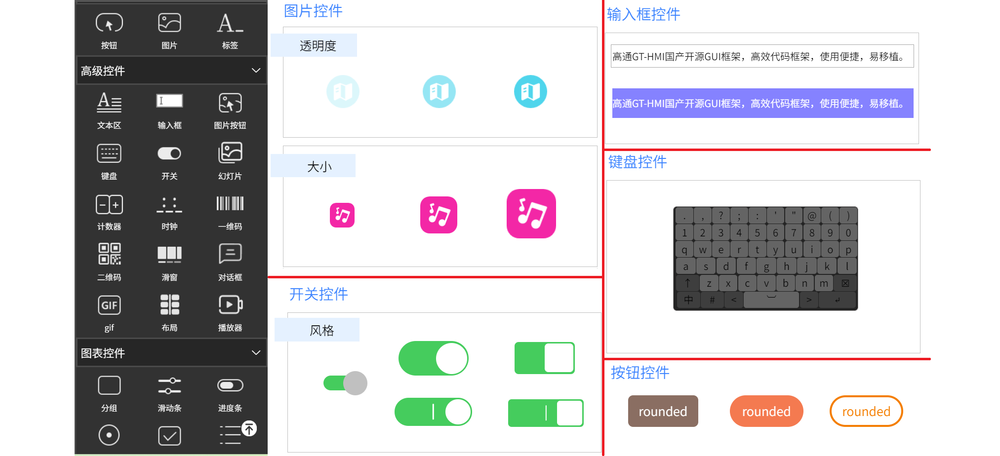
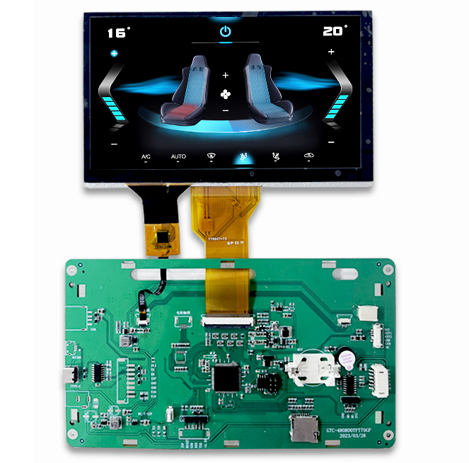
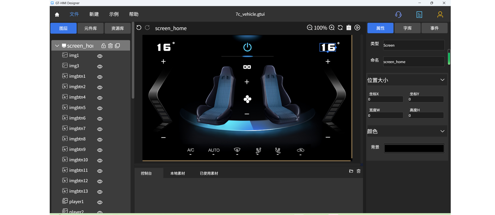

 

    

 

  <a><b>GT HMI Designer控件及代码示例</b></a>

  <a><b>致力于低代码开发，多功能，易用的免费嵌入式图形库</b></a>

---

#### 介绍

&nbsp;&nbsp;&nbsp;&nbsp;&nbsp;&nbsp;&nbsp;&nbsp;GT-HMI Example项目是基于GT-HMI嵌入式GUI框架的示例展示项目。GT-HMI是一款国产开源GUI框架，包含GT-HMI Engine（下位机）和GT-HMI Designer（上位机）。GT-HMI Engine是一款高效的嵌入式GUI引擎，助力开发者快速构建、集成和优化UI应用程序。GT-HMl Designer可在桌面端设计嵌入式的UI交互并生成下位机代码和进行实时仿真，可以轻松打造自定义高度可视化的嵌入式系统用户界面，本次更新全面展示了GT-HMI Designer的控件及代码示例，并附有详细注释，通过本项目，开发者可以轻松掌握GT-HMI Designer的各类控件，并最终构建出多样化的交互式应用。

    

 

#### 控件菜单及部分控件示例

 

    

 

#### 实际项目显示效果

 

    

 

#### 实际项目对应的Designer仿真

 

    

 

    

#### 项目架构

<li> GT-HMI-Example文件夹结构</li>
<table>
 <tr>
  <td>  |-board/</td>
  <td>资源文件及代码</td>
 </tr>
 <tr>
  <td>  |-out/</td>
  <td>资源文件及代码（适合非HMI模块用户）</td>
 </tr>
 <tr>
  <td>  |-screen/</td>
  <td>UI界面交互代码</td>
 </tr>
 <tr>
  <td>  |-sources/</td>
  <td>图片素材文件</td>
 </tr>
 <tr>
  <td>  |-widget.gtui尾缀文件</td>
  <td>模块的示例工程文件，使用HMI-Designer打开</td>
 </tr>
</table>

#### 快速开始

<ul>
<li style="margin-bottom: 4px;">软件安装：
   <ul>
     <li>从<a href="https://www.hmi.gaotongfont.cn" target="_blank">高通官网</a> www.hmi.gaotongfont.cn 下载并安装HMI-Designer软件，用于打开GT-HMI-Example文件夹中的widget.gtui工程文件。</li>
   </ul>
</li>
<li style="margin-bottom: 4px;">加载示例：
  <ul>
    <li>在GT HMI Designer中打开文件夹中的工程文件widget.gtui，可以查看界面的内容和进行编译。</li>
    <li>工程编译后将board文件夹内的resource.bin文件使用烧录器烧录到自己设计的PCB板中的GUI芯片中，如使用高通的HMI模块或者GUI-LCD开发板，则使用SD卡升级即可。</li>
    <li>如需购买高通的HMI模块或者GUI-LCD开发板请点击<a href="https://shop394781219.taobao.com/index.htm?spm=2013.1.w5002-23418933304.2.44c57b8fcEn8Qf" target="_blank">高通智享工坊</a>购买，</li>
  </ul>
</li>
<li style="margin-bottom: 4px;">数据手册：<ul>
<li> <a href="https://www.hmi.gaotongfont.cn/gthmiengineyhsc"> Engine 使用手册 </a> |
    <a href="https://www.hmi.gaotongfont.cn/gthmidesigneryhsc"> Designer 使用手册 </a> |</li></ul></li>
<li style="margin-bottom: 4px;">移植：<ul>
<li>移植教程请点击<a href="https://www.hmi.gaotongfont.cn/gthmiengineyzczlc" target="_blank">移植教程</a>来移植本示例的out及screen文件夹代码。</li></ul></li>
<li style="margin-bottom: 4px;">编译与下载：<ul>
编译已下载步骤请点击观看<a href="https://space.bilibili.com/3493293474188211/channel/collectiondetail?sid=3764678">高通GT-HMI零基础详细教程</a>的前三章教程</ul></li>
<li style="margin-bottom: 4px;">测试运行：<ul>
<li>下载后，点击界面下面的按钮控件，看是否能够正常切换界面</li></ul></li>
</ul>

#### 相关视频教程

**Desinger功能特点**

         GT HMI Designer是一款功能强大的嵌入式人机界面设计软件。它提供直观的可视化设计界面，支持多种常用控件和丰富的交互功能。此外，它还支持多国语言界面设计和强大的仿真功能。通过GT HMI Designer，您可以轻松设计出美观、交互性强的界面，满足各种应用场景的需求。

**高通GT-HMI零基础详细教程合集(最新)(推荐)**

<ul>
<li style="margin-bottom: 4px;"><a href="https://space.bilibili.com/3493293474188211/channel/collectiondetail?sid=3764678">高通GT-HMI零基础详细教程</a></li>
</ul>

**Desinger视频教程**

<ul>
<li style="margin-bottom: 4px;"><a href="https://www.bilibili.com/video/BV1Xm4y1h7vs/?spm_id_from=333.999.0.0&vd_source=8ecf13d60f5e8ce6a592b252d351e954">第一章 软件安装与工程创建</a></li>
<li style="margin-bottom: 4px;"><a href="https://www.bilibili.com/video/BV1va4y137ac/?spm_id_from=autoNext&vd_source=8ecf13d60f5e8ce6a592b252d351e954">第二章 简单工程的制作</a></li>
<li style="margin-bottom: 4px;"><a href="https://www.bilibili.com/video/BV1Uo4y1V7pg/?spm_id_from=333.999.0.0&vd_source=8ecf13d60f5e8ce6a592b252d351e954">第三章 控件介绍（上）</a></li>
<li style="margin-bottom: 4px;"><a href="https://www.bilibili.com/video/BV1fs4y1u7uz/?spm_id_from=333.999.0.0&vd_source=8ecf13d60f5e8ce6a592b252d351e954">第四章 控件介绍（下）</a></li>
<li style="margin-bottom: 4px;"><a href="https://www.bilibili.com/video/BV1Ds4y1B7iW/?spm_id_from=333.999.0.0&vd_source=8ecf13d60f5e8ce6a592b252d351e954">第五章 事件交互介绍</a></li>
</ul>

 

**Engine功能特点**

        GT HMI Engine是一款功能强大、高性能、多平台、多语言、稳定可靠的嵌入式人机界面引擎，提供丰富的控件和强大的交互功能。

**Engine 视频教程**

<ul>
<li style="margin-bottom: 4px;"><a href="https://www.bilibili.com/video/BV1Y24y1N7Bq/?spm_id_from=333.999.0.0&vd_source=8ecf13d60f5e8ce6a592b252d351e954">第六章 下位机工程移植</a></li>
<li style="margin-bottom: 4px;"><a href="https://www.bilibili.com/video/BV1Jh411c7jn/?spm_id_from=333.999.0.0&vd_source=8ecf13d60f5e8ce6a592b252d351e954">第七章 上下位机联动</a></li>
</ul>
 

**智匠chatbot API接口文档**

<ul>
<li style="margin-bottom: 4px;"><a href="https://apifox.com/apidoc/shared-0fd7ea54-919e-4c93-b673-c60219bc82e0/api-213657897">chat bot 参数获取</a></li>
<li style="margin-bottom: 4px;"><a href="https://apifox.com/apidoc/shared-0fd7ea54-919e-4c93-b673-c60219bc82e0/api-213657897">chat_bot_v1 API接口及示例</a></li>
</ul>

 

**智匠AI KEY申请流程**

<ul>
<li style="margin-bottom: 4px;"><a href="https://apifox.com/apidoc/shared-0fd7ea54-919e-4c93-b673-c60219bc82e0/doc-4739665">如何获取API KEY</a></li>
</ul>

 

    <a href="https://www.hmi.gaotongfont.cn"
    > 公司官网 </a> |
    <a href="https://space.bilibili.com/3493293474188211/channel/collectiondetail?sid=3764678"
    > B 站教程 </a> |
    <a href="https://www.hmi.gaotongfont.cn/gthmiengineyhsc"
    > Engine 使用手册 </a> |
    <a href="https://www.hmi.gaotongfont.cn/gthmidesigneryhsc"
    > Designer 使用手册 </a> |
    <a href="http://isite.baidu.com/site/wjz7qkrv/406a2b0c-f9c7-4a08-a47a-662e862b2af4?ch=48&wid=498ccd5c05334f21a2142ba3cf628964_0_0&field=&orderBy=&categoryId=undefined&title=%E8%81%94%E7%B3%BB%E6%88%91%E4%BB%AC"
    > 联系方式 </a> |
    <a href="https://genitop-1317577547.cos.ap-nanjing.myqcloud.com/GT-HMI/GT-HMI-Groups/GT-HMI%20Communication%20groups.jpg"
    > GT HMI微信交流群 </a>

 
